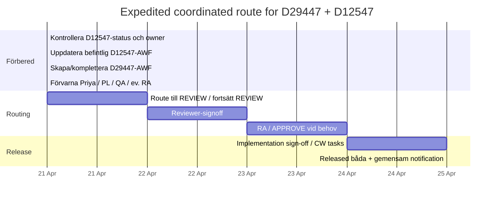

# Plan för att få igenom D29447 och D12547 tillsammans i Agile

## Lägesbild

Primärkällorna i `123.zip` har granskats lokalt: **D2835**, **D37138**, **D0001**, **D34992**, **D17336**, **D4271**, **D10724** samt ditt uppladdade **D12547**. `123.zip` var inte citerbart via filverktyget i den här sessionen, så detaljer från zip nedan anges som **lokalt verifierade**. Där jag använder officiella externa källor för generiska verktygsexempel eller allmän release-logik citeras de. D12547 självt är en global SOP med Solna-specifika avsnitt och Solna Table 11. fileciteturn0file0

Det viktigaste som styr din plan är detta, lokalt verifierat i zip:

- **Skapa inte en andra Change Order för samma item.** Om **D12547 redan ligger på en pending AWF**, ska du **inte** öppna en ny AWF för D12547.
- **Separata AWFs är tillåtna**, och en **eCR kan bära flera Change Orders**, så länge du inte duplicerar samma item på två öppna Change Orders.
- I **AWF REVIEW** kan du fortfarande uppdatera vissa fält på Cover Page och använda **CheckOut / CheckIn** på filerna.
- **Extra approvers utöver matrisen är inte tillåtna**. Om du behöver synlighet/snabbhet, lägg folk som **Reviewer / Acknowledger / Observer**, inte som ad hoc-approvers.
- **Quality reviewer** är obligatorisk reviewer-funktion; Document Control läggs in automatiskt; Regulatory Affairs och/eller Operational Assessment kan triggas beroende på Impact Assessment.
- För trainable dokument behöver du tidigt säkra **Transfer Document(s) to ComplianceWire?**, curriculum-task och ev. quiz-review så att ni inte fastnar i **IMPLEMENT-REVIEW**.

Det betyder att den **lägsta arbetsinsatsen med lägst risk** är:

- **Behåll D12547 i dess befintliga pending AWF** och uppdatera den där, **om status tillåter**.
- **Skapa/behåll en separat AWF för D29447**.
- **Sänk risken genom att synka release**, inte genom att öppna en ny D12547-AWF.
- Om D12547 redan är för långt i routing för att säkert ändras, använd fallback: **neutralisera D29447-referensen** tills D12547 hinner ikapp.

Som generell verktygslogik stöds den här typen av statusstyrd routing också i andra vanliga plattformar: i Jira sker transition via **Status**-menyn och godkännanden kan göras obligatoriska i workflow-konfigurationen; i ServiceNow kan en change skickas tillbaka med **Revert to New** vilket också nollställer pending approvals; i Aras sker state-promotion via **Promote** i toolbar/kontxtmeny. citeturn3search6turn3search1turn3search0turn0search0turn1search0

## Rekommenderad väg

**Rekommendation:** route **together**, men **inte** genom att skapa en ny D12547-AWF.  
Gör i stället så här:

- **D12547:** uppdatera den **befintliga** pending AWF:n med minimal Solna-text.
- **D29447:** route i **egen** AWF.
- **Koppla ihop dem i audit trail** med AWF-referenser i comments/Description.
- **Släpp dem samma dag/samma releasefönster**.

Detta är också den renaste audit storyn i ett Oracle/Agile-liknande PLM-flöde, eftersom det är **RELEASED** som gör ändringen gällande; i Oracle-dokumentation beskrivs release som den punkt där ändringarna träder i kraft, medan ev. senare “complete/implemented” handlar om efterföljande aktiviteter. citeturn2search1

### Antaganden

Följande är **ospecificerat** och därför hanteras med säkra alternativ:

- **Nuvarande AWF-status** för D12547 och D29447 är ospecificerad.
- **Exakta approvers/stakeholders** är ospecificerade, eftersom D0001_AWF-matrisen och den separata Reviewer/Approver-resurslistan ligger utanför zip.
- **Ditt Agile-UI** antas vara Oracle Agile/Agile PLM-liknande utifrån dokumenten i zip, men om front-end skiljer sig åt finns generiska fallback-exempel längre ned.
- **UAWF-behörighet** och kriterier för “urgent” är ospecificerade; planen nedan utgår därför från vanlig AWF, inte UAWF.

### Säkra statusgrenar för D12547

| D12547-status i Agile | Gör så här nu | Säker alternativväg |
|---|---|---|
| **PENDING** | Uppdatera dokument + Cover Page direkt i befintlig AWF | Bästa läget |
| **REVIEW** | Uppdatera fil med **CheckOut / CheckIn / Replace**, uppdatera tillåtna Cover Page-fält, lägg ev. extra reviewers via **Workflow > Add Reviewers** | Fortfarande bra läge |
| **SUBMIT/REGULATORY AFFAIRS** eller **APPROVE** | Försök **inte** smyga in content-ändringar. Antingen: 1) låt required approver rejecta tillbaka till PENDING, eller 2) välj fallback och route D29447 separat | Fallback rekommenderas om tidspress |
| **IMPLEMENT-REVIEW** | Undvik att backa om inte Change Analyst/Doc Control uttryckligen vill det | Fallback |
| **RELEASED** | Ingen samrouting möjlig längre | Släpp D29447 separat med neutral text |

## Prioriterad Agile-checklista

### Först: verifiera live-läget

Det här gör du **nu**, i denna ordning:

1. **Sök upp D12547 i Agile**  
   Kontrollera:
   - finns en **befintlig pending AWF**?
   - vad står i **Cover Page > Status**?
   - vem är **Originator**?
   - ligger den på ett eCR som fortfarande är aktivt?

2. **Skapa inte en ny AWF för D12547**  
   Om D12547 redan ligger på en open/pending change order: **stoppa** all tanke på en andra D12547-AWF.

3. **Sök upp / skapa D29447-AWF**
   - Om den inte finns: gå via relevant eCR och använd  
     **`Actions > Generate AWF`**
   - Öppna sedan nya AWF:n via **`Relationships`**-tabben.

### Om D12547 står i PENDING

Gör detta direkt i befintlig D12547-AWF:

- **`Cover Page > Edit`**
  - uppdatera:
    - **Description/Reason For Change**
    - **Impact/Risk/Justification**
    - **Implementation Tasks**
    - **Implementation Actions**
    - **Sites Affected by Change?**  
      Sätt detta korrekt. Om endast Solna påverkas operativt: använd Solna/Sweden enligt er konfiguration. Om global påverkan faktiskt finns: välj alla berörda site(s).

- **`Affected Items`**
  - öppna D12547-itemet
  - uppdatera reviderad fil enligt er normala redline/process

- **Verifiera dokument-itemets `Title Block`**
  - **Affected Sites**
  - **Affected Departments**
  - **Transfer Document(s) to ComplianceWire?**
  - **Notification List** (om quiz finns)

### Om D12547 står i REVIEW

Det här är fortfarande fullt användbart och sannolikt din snabbaste väg:

- På **Cover Page** får du fortfarande uppdatera:
  - **Description/Reason For Change**
  - **Impact/Risk/Justification**
  - **Implementation Tasks**
  - **Implementation Actions**

- För själva filen:
  - gå till **`Affected Items`**
  - klicka item-länken
  - öppna **`Attachments`**
  - använd:
    - **`CheckOut`**
    - gör ändringen
    - **`CheckIn`**
    - **`Replace`**

- Om du behöver lägga till synlighet utan att bryta matrisen:
  - gå till **`Workflow > Add Reviewers`**
  - lägg Priya eller annan nyckelperson som:
    - **Acknowledger** eller
    - **Observer**
  - lägg **inte** till extra approvers om de inte krävs av matrisen.

### Om D12547 står i APPROVE eller senare

Gör ett snabbt vägval inom 10–15 minuter:

**Alternativ A — route together fortfarande möjligt**  
Be en **required approver** att **Reject** AWF:n tillbaka till **PENDING** med en tydlig kommentar om att innehållet måste synkas med D29447.

**Alternativ B — lower-risk fallback**  
Låt D12547 fortsätta i sin befintliga AWF och gör D29447 fristående genom att använda neutral site-procedure-text i D29447. Det är mindre elegant, men snabbare och säkrare om D12547 är för långt gången.

### D29447-AWF

I den separata D29447-AWF:n gör du detta:

- **`Cover Page > Edit`**
  - fyll i:
    - **Description/Reason For Change**
    - **Impact/Risk/Justification**
    - **Implementation Tasks**
    - **Implementation Actions**
    - **Sites Affected by Change?**
- **`Affected Items`**
  - lägg till reviderad D29447-fil
- Lägg in en **tydlig cross-reference** till D12547-AWF:n i comments/description.

### Routing

När båda är redo:

- Från **PENDING**:
  - **`Next Status > Review > Finish`**
- I **REVIEW**:
  - låt reviewers signera
  - svara på comments samma dag
  - **ta inte bort auto-added grupper**
- Efter REVIEW:
  - originator flyttar vidare
  - om Impact Assessment triggar RA går AWF till **SUBMIT/REGULATORY AFFAIRS**
  - annars till **APPROVE**
- I **APPROVE**:
  - alla required approvers måste approve
- Om Implementation Tasks finns:
  - jaga task owners direkt så ni inte fastnar i **IMPLEMENT-REVIEW**

### Om ditt verktyg inte exakt ser ut som Oracle Agile

Använd motsvarande funktion:

- **Jira / Jira Service Management**  
  - transition: **`Status`**-menyn högst upp på ärendet  
  - workflow-visning: **`View workflow`**  
  - gör approvals obligatoriska via  
    **`Space settings > Workflows > Edit workflow > Include approval step > Publish draft > Publish`**. citeturn3search6turn3search1turn3search0

- **ServiceNow**  
  - om du måste backa om för att lägga till scope/innehåll före ny routing, använd **`Revert to New`** från context menu där tillgängligt; då startas workflow om och pending approvals annulleras. citeturn0search0turn0search4

- **Aras**  
  - state promotion sker via **`Promote`** i item toolbar eller context menu. citeturn1search0

## Minimal routingsekvens

Det här är den kortaste, mest robusta sekvensen du kan köra **nu**.

### Primär väg

1. **Öppna D12547 befintliga AWF**
2. **Läs av Status**
3. **Om PENDING/REVIEW: uppdatera D12547 där**
4. **Öppna/skapa D29447-AWF**
5. **Lägg in cross-reference comments i båda**
6. **Förvarna reviewers/approvers innan routing**
7. **Route båda samma dag**
8. **Driv båda till RELEASED samma dag eller nästa arbetsdag**
9. **Skicka ett gemensamt release-meddelande**

### Två säkra alternativ om något blockerar

**Om blockeraren är D12547-status:**  
- APPROVE/IMPLEMENT-REVIEW/RELEASED → släpp D29447 separat med neutral formulering.

**Om blockeraren är approver-matris eller resurslista:**  
- använd auto-populerade required approvers
- lägg endast till Priya m.fl. som Reviewers/Acknowledgers/Observers
- om en required approver saknas eller är fel: lyft till Change Analyst/Document Control, inte till ad hoc-manual fixes.

## Risk, rollback och audit trail

### Största riskerna

| Risk | Konsekvens | Mitigering |
|---|---|---|
| Ny D12547-AWF öppnas fast itemet redan är på pending AWF | audit-problem, omarbete, stopp | Öppna **inte** ny D12547-AWF |
| Priya/andra läggs som extra approvers | avvikelse mot D0001-matris | Lägg dem som Reviewer/Acknowledger/Observer |
| D12547 är för långt gången i workflow | D29447 blockeras | Fallback: neutralisera D29447-referens och route separat |
| ComplianceWire/quiz/curriculum missas | fastnar i IMPLEMENT-REVIEW | Verifiera trainability + implementation tasks tidigt |
| D29447 refererar för hårt till D12547 | global/site mismatch | använd neutral site-procedure-formulering om ni inte kan släppa ihop |

### Rollback-steg

1. **Om D12547 visar sig stå i APPROVE eller senare**
   - avbryt “together”-spåret
   - gå direkt till fallback för D29447

2. **Om reviewers ifrågasätter global/site-logik**
   - ändra D29447-noten till neutral site-procedure-text
   - låt D12547 ta Solna-detaljen separat

3. **Om fel reviewers har lagts till**
   - korrigera i **REVIEW** via **`Workflow > Add Reviewers`**
   - undvik att skapa approver-kaos

4. **Om innehållet i D12547 måste ändras men AWF redan är i APPROVE**
   - be required approver rejecta tillbaka till **PENDING**
   - lägg in endast den minimala ändringen
   - rerouta omedelbart

### Exakta audit entries för AWF-comments

Kopiera in detta i **D12547 AWF comments**:

```text
Minimal Solna-only update added to align handling/pause criteria with D29447 reduced outer film seal classification. No new change order created for D12547 to avoid duplicate change order on the same item.
```

Kopiera in detta i **D29447 AWF comments**:

```text
Coordinated release requested with D12547 existing AWF to avoid cross-document mismatch. D29447 defines classification/tool use; D12547 defines handling/pause criteria for Solna.
```

Om du måste köra fallback och släppa D29447 separat:

```text
Reference to D12547 handling has been neutralized for this release to avoid dependency on unreleased handling text. Site-specific handling will be routed separately.
```

Om du behöver få D12547 rejectad tillbaka till PENDING:

```text
Please return this AWF to PENDING to incorporate a minimal dependency alignment with D29447 and avoid a temporary cross-document mismatch at release.
```

## Meddelanden och copy-paste

### Meddelande till Priya

```text
Hi Priya — I checked the Agile workflow rules. We should not create a second change order for D12547 if it is already on a pending AWF. My proposal is to update the existing D12547 AWF with the minimal Solna text and route D29447 in a separate AWF, then synchronize release of both to avoid a temporary mismatch. If D12547 is already beyond REVIEW, the fallback is to neutralize the D29447 reference and route the handling update separately.
```

### Meddelande till projektledaren

```text
Thanks. Based on the Agile workflow rules, we should avoid opening another change order for D12547 if it is already on a pending AWF. I recommend updating the existing D12547 AWF and routing D29447 in a separate AWF, then driving both to release together. This gives us synchronized release without violating the one-item/one-open-change-order rule.
```

### Meddelande till QA-approvers

```text
Hi all — two linked document changes are being expedited for synchronized release: D29447 (classification / visual aid) and D12547 (Solna handling / pause criteria). The intent is to avoid a temporary mismatch between classification and handling. Please prioritize review/approval as soon as possible and use AWF comments for any blocking issues.
```

### Tvåradig Teams-reply

```text
I checked the Agile rules: we should not open a second change order for D12547 if it is already on a pending AWF.
Best path is to update the existing D12547 AWF, route D29447 separately, and synchronize release of both.
```

### SOP-edits för D12547

**Ersätt 5.4.2.2 med detta:**

```text
5.4.2.2. (For Solna) Notify ROBAL and technicians of failures and observations. Request technical action. ROBAL should be paused if 2 delaminations/separations, misaligned film seals, 2 identical visual failures, or 2 identical reduced outer film seal observations (≤10% unsealed per D29447) are observed within 3 sampling points. On sampling point 00-06, pause for 2 identical findings no matter on which sampling point the finding occurred. Reduced outer film seal observations (≤10% unsealed per D29447) are PASS and shall be recorded as an OBSERVATION.
```

**Lägg till denna NOTE i Table 11 (Solna only):**

```text
NOTE: Reduced outer film seal observations (≤10% unsealed per D29447) are PASS and shall be recorded as an OBSERVATION. These observations are counted toward ROBAL pause criteria.
```

### Rekommenderad neutral D29447-text om ni måste minimera beroendet

Om D29447 i dag refererar för hårt till D12547, använd denna lägre-risk-formulering:

```text
NOTE: Handling and escalation criteria for reduced outer film seal findings are defined in applicable site procedures/work instructions.
```

Om du absolut vill ge Solna som exempel utan att göra påståendet globalt fel:

```text
NOTE: Handling and escalation criteria for reduced outer film seal findings are defined in applicable site procedures/work instructions (e.g., D12547 for Solna).
```

## Alternativ och tidslinje

### Jämförelse av två vägar

| Alternativ | Fördelar | Nackdelar | Rekommendation |
|---|---|---|---|
| **Route together** | ren logik mellan D29447 och D12547, snygg audit trail, mindre risk för driftförvirring | D29447 blir beroende av att D12547 går att uppdatera/routa | **Rekommenderas**, om D12547 befintliga AWF är i PENDING/REVIEW eller snabbt kan backas |
| **Route separately** | D29447 kan släppas snabbare | kräver neutralisering av beroende, mer omarbete senare, sämre traceability | använd endast som fallback när D12547 är för långt gången |

### Rekommenderad tidslinje



**Om D12547-status i verkligheten är APPROVE eller senare:**  
byt omedelbart till fallback:
- neutralisera D29447-referensen,
- route D29447 separat,
- låt D12547 befintliga AWF fortsätta utan omtag.